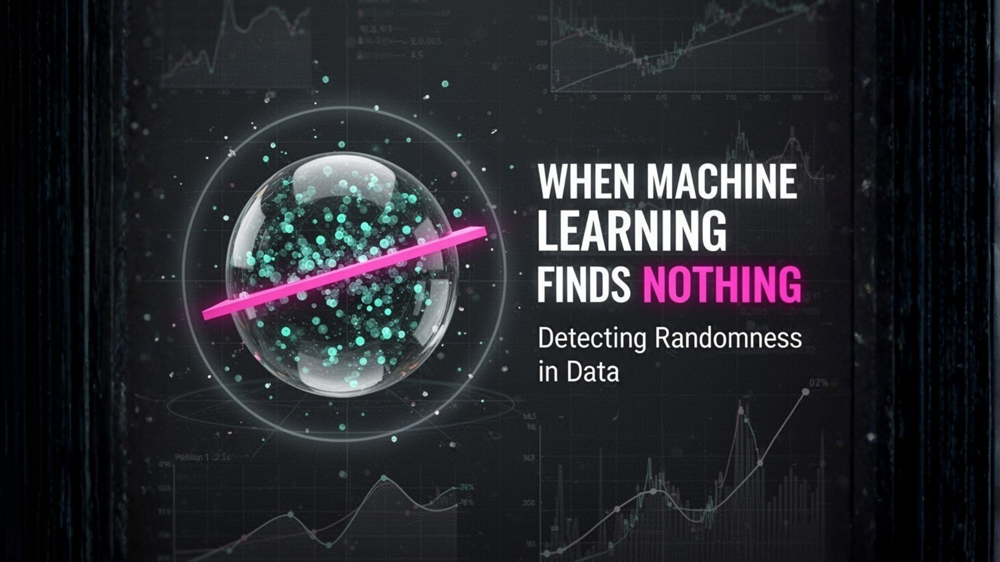

# 🎯 When Machine Learning Correctly Detects Randomness

A statistical case study showing that machine learning correctly identifies the absence of predictive signal in educational data.

[](https://www.python.org/)
[](LICENSE)
[](#)

---

## 🔗 Project Links

| Resource | Access |
|----------|--------|
| 📒 **Kaggle Notebook** | https://www.kaggle.com/code/yuvalshahtech/when-ml-finds-nothing |
| 📊 **Dataset** | https://www.kaggle.com/datasets/haseebindata/student-performance-predictions |
| 💻 **GitHub Profile** | https://github.com/yuvalshahtech |

---

## 📝 Overview

A rigorous statistical investigation demonstrating that **machine learning did not fail—it correctly detected the absence of predictive signal** in a student performance dataset. This project challenges the common misconception that ML can extract patterns from any data by employing **six complementary validation methods** to conclusively verify that no meaningful relationship exists between student features and final grades.

**Core Insight:** Knowing when *not* to deploy machine learning is as valuable as knowing when to use it—this analysis demonstrates critical data science thinking.

---

## 💡 Key Insight

> **Machine learning successfully identified that this dataset behaves like randomness with no exploitable structure.**

Through comprehensive statistical analysis—including correlation testing, multivariate regression, cross-validation, residual diagnostics, permutation testing, and baseline comparison—we conclusively demonstrate that student final grades cannot be predicted from the available features. **The model's failure to predict is itself the correct result.**

**What makes this significant:** In production environments, deploying models without validated predictive signal leads to wasted resources, false confidence, and potential harm. This project demonstrates the essential first step of any ML pipeline: signal validation before model development.

---

## 📊 Dataset

**Source:** Student Performance Predictions Dataset ([Kaggle](https://www.kaggle.com/datasets/haseebindata/student-performance-predictions))

| Attribute | Details |
|-----------|---------|
| **Records** | 889 students (after cleaning) |
| **Target Variable** | `FinalGrade` (continuous: 62–93) |
| **Feature Count** | 6 behavioral and academic predictors |
| **Type** | Synthetic educational data |

### Feature Description

| Feature | Type | Range | Description |
|---------|------|-------|-------------|
| `PreviousGrade` | Numeric | 60–92 | Student's prior academic performance |
| `StudyHoursPerWeek` | Numeric | 5–30 | Weekly study time commitment |
| `AttendanceRate` | Numeric | 70–95% | Class attendance percentage |
| `ExtracurricularActivities` | Numeric | 0–3 | Number of extracurricular involvements |
| `ParentalSupport` | Categorical | Low/Medium/High | Level of parental engagement |
| `OnlineClassesTaken` | Categorical | Yes/No | Online learning participation |

**Intuitive Expectation:** One would naturally expect final grades to correlate with prior performance, study effort, and attendance. This analysis rigorously tests whether such relationships exist in the data.

---

## 🔬 Methodology

This analysis employs **six complementary statistical approaches** to triangulate whether predictive signal exists:

### 1. Univariate Correlation Analysis
- Pearson correlation coefficients between each predictor and target
- Statistical significance testing (p-values)
- Distribution analysis and missing value inspection

### 2. Multivariate Regression (OLS)
- Full model with all predictors
- Coefficient significance testing
- R², Adjusted R², and F-statistic interpretation

### 3. Residual Diagnostics
- Q-Q plots for normality assessment
- Residuals vs. fitted values (homoscedasticity)
- Shapiro-Wilk test for distribution verification
- Scale-location plots for variance stability

### 4. Baseline Comparison
- Compare model MSE against predicting the unconditional mean
- Quantify actual improvement (if any exists)

### 5. Cross-Validation
- 5-fold CV to test generalization
- Compute out-of-sample R² scores
- Detect overfitting vs. genuine signal

### 6. Permutation Testing
- Shuffle target variable and recompute statistics
- Compare shuffled vs. original correlations
- Verify findings are not due to sampling artifacts

**Why Multiple Methods?** Single-metric evaluation is insufficient. Convergent evidence across diverse approaches provides robust conclusions.

---

## 📈 Results

All six validation methods converge on the same conclusion: **zero predictive signal exists**.

### Univariate Correlations

| Predictor | Pearson r | P-value | Interpretation |
|-----------|-----------|---------|----------------|
| `PreviousGrade` | 0.005 | 0.883 | Not significant (p >> 0.05) |
| `StudyHoursPerWeek` | 0.022 | 0.527 | Not significant |
| `AttendanceRate` | -0.012 | 0.720 | Not significant |
| `ExtracurricularActivities` | -0.019 | 0.582 | Not significant |

**Finding:** All correlations near zero with p-values far above significance threshold.

### Multivariate Regression (OLS)

| Metric | Value | Interpretation |
|--------|-------|----------------|
| **R²** | 0.003 | Only 0.3% of variance explained |
| **Adjusted R²** | -0.007 | **Negative** (worse than intercept-only) |
| **F-statistic** | 0.39 | Model not statistically significant |
| **Overall p-value** | > 0.05 | Cannot reject null hypothesis |

**Finding:** Model explains zero variance; all predictor coefficients have p > 0.05.

### Model vs. Baseline Performance

| Comparison | Model MSE | Baseline MSE | Difference |
|------------|-----------|--------------|------------|
| **Performance** | 89.80 | 90.04 | **-0.27% worse** |

**Finding:** The model performs *worse* than predicting the mean—strong evidence of no signal.

### Cross-Validation (5-Fold)

| Fold | R² Score |
|------|----------|
| Fold 1 | -0.016 |
| Fold 2 | -0.050 |
| Fold 3 | -0.041 |
| Fold 4 | -0.017 |
| Fold 5 | -0.062 |
| **Mean CV R²** | **-0.037** (SD: 0.018) |

**Finding:** Consistently negative out-of-sample R². Model captures noise, not signal.

### Residual Diagnostics

| Test/Plot | Observation | Conclusion |
|-----------|------------|------------|
| **Shapiro-Wilk Test** | p < 0.001 | Residuals not normally distributed |
| **Q-Q Plot** | Significant deviation from normal line | Non-normality confirmed |
| **Residuals vs. Fitted** | Random scatter, no pattern | Homoscedasticity holds |
| **Scale-Location** | Slight upward trend | Minor variance increase |

**Finding:** While assumption violations exist, they are secondary since the model has zero predictive power.

### Permutation Testing

| Scenario | Correlation with FinalGrade |
|----------|----------------------------|
| **Original** `PreviousGrade` | 0.005 |
| **Shuffled** `FinalGrade` | ~0.002 |
| **Difference** | Negligible |

**Finding:** Shuffling the target produces virtually identical correlations—confirming randomness.

---

## 🎓 Key Takeaways

### Primary Conclusion

> **Machine learning correctly identified the absence of predictive signal in this dataset.**

The convergent evidence is unambiguous:

- ✅ **Zero univariate correlations** (all p > 0.05)
- ✅ **Near-zero R²** in multivariate regression (0.003)
- ✅ **Negative adjusted R²** (-0.007)
- ✅ **Model worse than baseline** (-0.27% performance)
- ✅ **Negative cross-validated R²** (-0.037 mean)
- ✅ **Permutation tests confirm randomness**

### Why This Matters for Data Science Practice

| Principle | Implication |
|-----------|-------------|
| **Signal validation first** | Always verify structure exists before modeling |
| **Statistical testing > blind modeling** | Use hypothesis tests, p-values, and diagnostics upfront |
| **Baseline comparison is mandatory** | If model doesn't beat "predict the mean," investigate |
| **Cross-validation reveals truth** | Negative CV R² is an immediate red flag |
| **EDA prevents wasted effort** | Exploratory analysis saves weeks of futile optimization |

### The Professional Insight

**Senior-level data science thinking means recognizing when NOT to deploy machine learning.** This project demonstrates:

1. Rigorous validation methodology before model development
2. Multi-method triangulation for robust conclusions
3. Statistical literacy and diagnostic interpretation
4. Resource-conscious decision-making
5. Transparent communication of negative results

Deploying a model on this data would waste computational resources, create false confidence, and potentially harm decision-making. **The correct action is no model.**

---

## 🛠 Technologies Used

| Technology | Purpose |
|------------|---------|
| **Python 3.8+** | Core programming language |
| **pandas** | Data manipulation and analysis |
| **NumPy** | Numerical computing |
| **scipy.stats** | Statistical tests (Pearson, Shapiro-Wilk, permutation) |
| **statsmodels** | OLS regression and diagnostic plots |
| **scikit-learn** | Cross-validation and model evaluation |
| **matplotlib** | Visualization (scatter plots, diagnostics) |
| **seaborn** | Statistical graphics |
| **Jupyter Notebook** | Interactive analysis environment |

---

## 📁 Project Structure

```
ml-no-signal-case-study/
├── README.md                                # Project documentation
├── randomness_edu.ipynb                     # Complete analysis notebook
├── student_performance_updated_1000.csv     # Student performance dataset
└── banner.png                               # Project banner image
```

**Key Files:**
- `randomness_edu.ipynb` — Full statistical analysis with visualizations
- `student_performance_updated_1000.csv` — 889 student records (post-cleaning)
- `README.md` — Comprehensive project documentation

---

## 🚀 How to Run

### Quick Start

```bash
# Install dependencies
pip install pandas numpy scipy statsmodels scikit-learn matplotlib seaborn jupyter

# Launch notebook
jupyter notebook randomness_edu.ipynb
```

### Detailed Setup

**1. Clone the Repository**
```bash
git clone <repository-url>
cd "Student Performance EDA"
```

**2. Create Virtual Environment (Recommended)**
```bash
# Windows
python -m venv .venv && .venv\Scripts\activate

# macOS/Linux
python3 -m venv .venv && source .venv/bin/activate
```

**3. Install Dependencies**
```bash
pip install pandas numpy scipy statsmodels scikit-learn matplotlib seaborn jupyter
```

**4. Run the Analysis**
```bash
jupyter notebook randomness_edu.ipynb
```

### Expected Outputs

- **Correlation Analysis:** All p-values > 0.05 (no significance)
- **Regression Results:** R² ≈ 0.003, Adjusted R² negative
- **Cross-Validation:** Negative R² scores across all folds
- **Diagnostic Plots:** Q-Q plots, residual plots, permutation tests

---

## 📚 References

### Dataset
- Haseeb. (2024). [Student Performance Predictions Dataset](https://www.kaggle.com/datasets/haseebindata/student-performance-predictions). Kaggle.

### Statistical Methods & Theory
- Hastie, T., Tibshirani, R., & Friedman, J. (2009). *The Elements of Statistical Learning: Data Mining, Inference, and Prediction* (2nd ed.). Springer.
- Shapiro, S. S., & Wilk, M. B. (1965). "An Analysis of Variance Test for Normality (Complete Samples)." *Biometrika*, 52(3/4), 591-611.
- Kohavi, R. (1995). "A Study of Cross-Validation and Bootstrap for Accuracy Estimation and Model Selection." *IJCAI*.

### Educational Data Mining
- Romero, C., & Ventura, S. (2010). "Educational Data Mining: A Review of the State of the Art." *IEEE Transactions on Systems, Man, and Cybernetics*, 40(6), 601-618.

---

## 👤 Author

**Yuval Shah**  
*Data Science | Educational Analytics | Statistical Validation*

Specializing in rigorous statistical analysis and responsible machine learning practices. This project demonstrates critical thinking in model development: validating signal existence before deployment.

---

## 📞 Contact

For questions, collaboration, or discussion:

- 📧 **Email:** yuvalshahtech@gmail.com
- 💼 **LinkedIn:** [linkedin.com/in/yuval-shah-tech](https://www.linkedin.com/in/yuval-shah-tech/)
- 🐙 **GitHub:** [github.com/yuvalshahtech](https://github.com/yuvalshahtech)

---

## 🤝 Acknowledgments

This analysis demonstrates best practices in statistical validation and responsible data science. If you found this project valuable, please consider:

- ⭐ **Starring** this repository
- 🔗 **Sharing** with fellow data scientists
- 💬 **Providing** feedback or suggestions

---

## 📝 License

This project is released under the **MIT License**. See [LICENSE](LICENSE) for details.

---

## 💭 Final Thought

> *"The best machine learning model for a dataset with no signal is the model that recognizes there is no signal."*

This project demonstrates exactly that principle—**knowing when not to build a model is as important as knowing how to build one.**

---

**Last Updated:** March 2026  
**Status:** Complete & Reproducible

